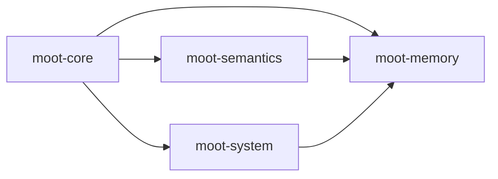

<!-- Generated by scripts/lib_publish/publish-libraries.py. Do not edit by hand. -->
# Dependency Graph

The four public repositories form one lockstep SDK family.

`moot-core` has no MOOT SDK dependency. `moot-semantics` and `moot-system`
depend on `moot-core`. `moot-memory` composes all three lower repositories.

The root `Package.swift` and `Cargo.toml` files are the executable dependency
truth for this release. [`PACKAGE_MAP.md`](PACKAGE_MAP.md) maps each package to
its Swift product, Rust crate, and maintained documentation.
