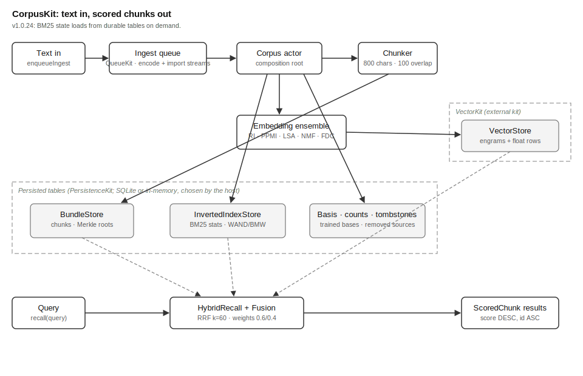

# CorpusKit Overview

## What This Kit Does

CorpusKit stores text. It finds that text again by meaning, and also by
keyword. It is the retrieval tier of MOOTx01, an on-device AI memory
system. The technique it uses has a name: retrieval-augmented generation,
or RAG. In RAG, an AI looks up stored material first. Then it answers.
The answer rests on real text, not on guesswork.

A kit is a larger package. It composes libraries into one subsystem.
CorpusKit composes storage, indexing, and embedding libraries. Together
they form one database-like surface. Callers hand it text. The kit
splits the text into chunks. It stores each chunk, then indexes it two
ways. A chunk is a piece of source text with a stable identity. Each
chunk is sized to a few sentences. Later, a caller hands the kit a
query. The kit returns the most relevant chunks, scored and ranked.

The kit stands alone. A developer can use it as a private RAG database.
No other MOOT component is required. Inside MOOTx01, the GeniusLocusKit
orchestrator uses CorpusKit differently. It treats the kit as the
estate's recall engine. An estate is one user's complete memory store.

## The Problem It Solves

Recall must work on the device. It must be deterministic. It must never
leak text. Cloud embedding services fail all three tests. They see
private content. They need a network connection. They change without
notice. If recall depended on such a service, a user's memory would be
neither private nor reproducible.

Federation raises the stakes further. MOOTx01 estates can share memories
across devices. Shared recall only works when every device computes the
same result from the same input. Call this the agreement property.

CorpusKit answers with two ranked lanes. Both run entirely on the
device. A lane is one independent way to score how well a chunk matches
a query. The keyword lane uses BM25. BM25 is a standard formula. It
rewards chunks that contain the query's rarer words. The semantic lane
uses embeddings instead. An embedding is a list of numbers, called a
vector, that represents what a text means. Texts with similar meaning
get nearby vectors. A rule called Reciprocal Rank Fusion then merges the
two lanes into one ranking. The rule is simple: it rewards any chunk
ranked high in either lane.

For the semantic lane, the kit ships an ensemble of five signals. Each
one is "honest." Honest means the signal reflects real word
co-occurrence, or real classification structure. It is never a disguised
hash of the surface text. The five signals are Random Indexing, PPMI,
LSA, NMF, and FDC. All five are classical statistical methods. None
needs a neural network. Each costs little to run. Each runs identically
on every platform. Shared conformance fixtures gate all five: recorded
input and output pairs that the Swift leg and the Rust leg must
reproduce exactly, byte for byte. The Rust leg lives in `rust/` and
`rust-providers/`. Optional neural providers plug into the same seam
when a host supplies a model. Four ship today: MiniLM, mpnet,
EmbeddingGemma, and two Apple NaturalLanguage providers.

## How It Works

Ingestion runs as a pipeline. Text enters through an ingest queue backed
by QueueKit. Callers never wait on encoding to finish. A background
drain worker takes batches from the queue. It hands each batch to the
`Corpus` actor, the kit's central type. The `Corpus` splits each text
into chunks with sentence-aware boundaries. Each chunk then receives a
content-addressed identity. Its UUID is computed from its source, its
offset, and its exact text. The same content always produces the same
identity. A repeat ingest of one document is therefore a harmless
no-op. Two federated devices that ingest the same content converge on
identical rows.

A second drain worker handles bulk import. It claims jobs from its own
queue stream and never touches the daily-driving stream above. It
chunks each item and updates the keyword index, but it skips training
and skips embedding. A bulk import instead trains its basis once. It
then embeds every chunk once, at the end, through an explicit reindex.
Skipping per-item training and embedding turns a large import from
repeated wasted work into one pass. For a SQLite estate, the import
worker also shards the chunking and tokenizing work across cores, then
merges the results back through one writer.

Each stored chunk is indexed twice. The keyword side tokenizes the
chunk. It records term frequencies in a persistent inverted index. An
inverted index is a table that maps each word to the chunks that contain
it. The semantic side runs the chunk through every configured embedding
signal. It writes the resulting vectors to VectorKit, the sibling kit
that owns vector storage and nearest-neighbor search. Content and
vectors join on the chunk's UUID string. A chunk and its meaning never
drift apart.

Four of the five honest signals are trainable. They learn a basis from
the corpus itself. A basis is the trained reference data a signal needs
to embed new text. One example is the word co-occurrence vectors that
Random Indexing accumulates. Training happens exactly twice: once
automatically on first ingest, and again whenever a caller requests an
explicit reindex. Trained bases serialize to a pinned little-endian byte
format and persist to storage. A reopened corpus embeds text right away.
It never has to retrain first.

Recall runs the same pipeline in reverse. The query is embedded once.
The vector lane fetches its nearest neighbors. The keyword lane fetches
its best BM25 matches. Reciprocal Rank Fusion merges the two rankings.
It uses pinned weights: 0.6 for the vector lane and 0.4 for the keyword
lane. The winning chunks hydrate from the chunk store, then return to
the caller as scored chunks. Ties always break toward the smaller
identifier. Results stay deterministic down to the last position.

Deletion is honest about its own limits. Chunk rows are immutable, so
removing a source cannot erase its chunk rows. Instead it deletes the
source's index rows and vectors. It also records a tombstone, which
every rebuild consults afterward. Expunging goes one step further: it
scrubs the stored text itself.

## How the Pieces Fit

Figure 1 shows the kit's topology. It shows the major parts, and how
data moves between them.

*Figure 1. Topology of CorpusKit. Ingested text flows through the queue
and the `Corpus` actor into the chunk store, the keyword index, and the
vector store. A query fans out to both index lanes. Reciprocal Rank
Fusion merges them into scored chunks. Dashed regions mark the external
kits and the persisted tables.*

The `Corpus` actor is the seam that everything passes through. It owns
the chunk store, called `BundleStore`. It owns the persistent keyword
index, called `InvertedIndexStore`. It also owns the basis store, the
counts store, and the tombstone store. It holds one slot per embedding
signal, too. The actor hides VectorKit behind its own surface. Consumers
never touch vector storage directly.

Beneath the actor sits an engine layer. The layer holds the sparse
types, the BM25 weighting code, the inverted index, and the fusion
function. The inverted index runs two exact algorithms, WAND and
Block-Max WAND. The whole engine layer is pure computation. It holds no
storage of its own.

The package splits into two targets on purpose. The `CorpusKit` core
target holds the storage layer, the engines, and the protocols. The
`CorpusKitProviders` target holds every concrete embedding provider and
tokenizer. A consumer that needs only storage and BM25 search never has
to pull in provider code or model seams.

## What Ships in the Package

The package ships two Swift targets. Together they hold thirty-four
Swift source files. It also ships two mirror Rust crates: `rust/` for
the core and `rust-providers/` for the providers. Shared canonical
vectors in `Tests/SharedVectors/` gate both legs. Three things must
match byte for byte across the legs: BM25 impacts, per-provider
embeddings, and serialized basis blobs. The kit bundles no model weights
of its own. A host that wants neural embeddings must inject an inference
function. Everything the kit itself computes stays deterministic. It
stays reproducible from the sources alone.
