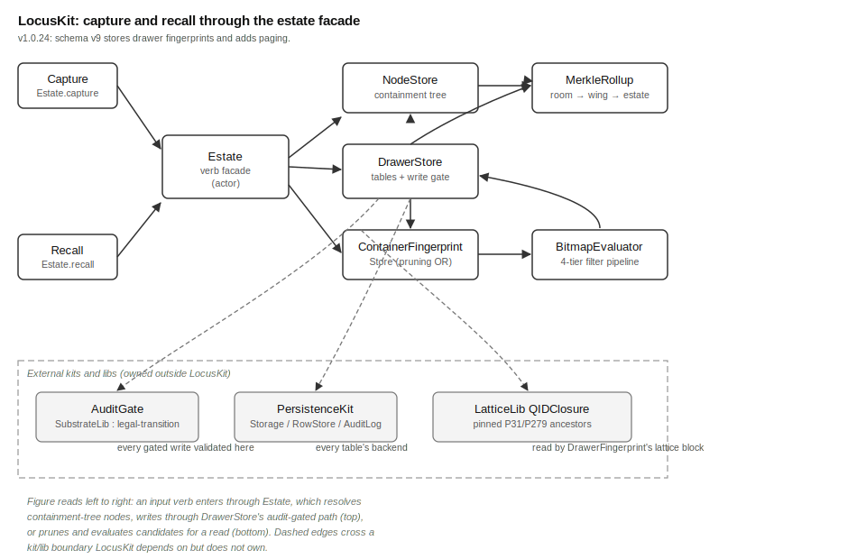

# LocusKit Overview

## What This Kit Does

LocusKit is the storage substrate for a MOOTx01 estate. An estate is
one user's complete memory store. MOOTx01 is an on-device AI memory
system. It stores what an AI observes over time. It helps the AI
recall that memory later. LocusKit is the layer that holds memories on
disk. It lets a caller file a memory, find it, and change its standing
over time.

LocusKit is a kit, not a library. A library, or lib, is a folder of
related files that does one job well. A kit is a larger package. A kit
composes several libraries into one subsystem. Kits may depend on
libs. Libs never depend back on kits.

LocusKit depends on several libs. `PersistenceKit` handles storage.
`SubstrateLib` and `SubstrateTypes` supply the write-gate math.
`SubstrateML` supplies classification math. `LatticeLib` supplies a
taxonomic lookup. LocusKit composes these libs into the estate's
spatial memory surface. A higher kit, `GeniusLocusKit`, builds on top
of LocusKit. This document does not cover `GeniusLocusKit`.

The word `MemPalace` names the spatial metaphor LocusKit implements.
Content lives in drawers. Drawers sit in rooms. Rooms sit in wings.
Wings sit in one estate. This document calls that three-level
structure the containment tree.

## The Problem It Solves

An AI's memory needs more than a place to store text. It must know if
a memory is still believed. It must know how sensitive a memory is. It
must know if a memory can leave the device. It must know how much to
trust a memory and where the memory came from. It needs to change its
mind about a memory. It must mark a memory as superseded, contested,
confirmed, or gone. It must do this without losing the history of that
change. It needs to find memories fast, by many criteria. It must do
this without scanning every row each time. It needs all of this to
survive a crash partway through a write.

LocusKit answers each of these needs with one mechanism per need.

- **Standing.** Every memory carries three packed 64-bit numbers. Each
  number is called a bitmap. One bitmap records the memory's adjective
  state: active, superseded, contested, accepted, rejected, or gone. A
  second bitmap records operational facts. It records the capture
  method and the content kind. A third bitmap records provenance:
  where the memory came from and how much the system trusts it. A
  bitmap is a fixed-size number. Different ranges of bits inside it
  are called fields. Each field holds one small, independent value.
  Packing many fields into one number keeps a memory's standing in a
  single machine word. Otherwise the record would need a dozen
  separate columns.
- **Safe change over time.** A memory's state does not move freely. It
  can move only along a fixed set of legal paths. For example, an
  active memory can become contested. A rejected memory cannot become
  accepted. LocusKit sends every state-changing write through a write
  gate, called `AuditGate`. `AuditGate` is owned by SubstrateLib. The
  gate checks that the move is legal. It then writes one sealed,
  tamper-evident audit event. That event records exactly what changed.
  The audit event, not the live row, is the source of truth. The live
  row is just a cached copy of the latest audit event, kept for fast
  reads. Row and log update together inside one transaction. So every
  value read back from a row matches a real sealed event in its audit
  log. The row is never observed one step ahead of its own history.
- **Fast, layered search.** A caller expresses a query as a chain of
  named filters. Filters name a concern in plain language, such as
  currently believed, in this room, or captured after this date.
  LocusKit compiles that chain through four tiers, from cheap to
  costly. The first tier is the bitmap tier. It runs near-free integer
  checks. The second tier is the structured tier. It checks room,
  wing, and lattice fields. The third tier is the content tier. It
  searches the verbatim text for a substring. The fourth tier is the
  ordering pass. It sorts the surviving rows. Before any of that, a
  per-container fingerprint check can rule out whole rooms or wings.
  It does this without loading a single row.
- **Crash safety.** Every state-changing write happens inside one
  database transaction. That transaction updates the live row and
  appends the audit event in one step. If the process dies partway
  through, the transaction commits both changes or neither. The live
  row and the audit log can never disagree about what happened.

## How It Works

### Nine kinds of rows, one set of patterns

LocusKit stores nine kinds of rows. This document calls each kind a
noun. The nine nouns are: `Drawer`, `Tunnel`, `DiaryEntry`, `KGFact`,
`Proposal`, `Association`, `LearnedReference`, `SourceCatalogEntry`,
and `Node`. `Drawer` holds verbatim content. `Tunnel` is a typed link
between two locations. `DiaryEntry` is a first-person agent record.
`KGFact` is a subject-predicate-object triple pulled from a drawer.
`Proposal` is a suggested change waiting for confirmation.
`Association` is a graph edge that records two rows belonging
together. `LearnedReference` is an external reference brought in by
the `learn` verb. `SourceCatalogEntry` is the durable record of where
a learned reference came from. `Node` is an entry in the containment
tree: the estate root, a wing, or a room.

Most of these nouns share the same three-bitmap pattern described
above. Each noun has its own file that decodes its own bitmap layout.
For example, `DrawerOperational.swift` decodes
`Drawer.operationalBitmap`. `KGFactOperational.swift` decodes
`KGFact.operationalBitmap`.

### The containment tree

Estates used to store a drawer's wing and room as two plain text
columns. LocusKit now stores them as a three-level tree of `Node`
rows. The estate root sits at depth zero. Wings sit at depth one.
Rooms sit at depth two. A drawer references its room through a foreign
key, `parentNodeId`, rather than by name.

`NodeStore` resolves a wing-and-room name pair to a node id. It
creates the node on first use. It returns the existing node on every
later use. So filing a drawer into "Personal / Health" always lands in
the same room node, no matter how many times the name is used. A
Merkle rollup, described below, walks this tree from bottom to top.
Renaming a room never requires touching every drawer inside it.

### The write gate

`DrawerStore` is the actor that owns every table. Nearly every write
that changes a row's standing is a gated write. A gated write happens
when a caller captures a drawer, moves its state, or edits an
adjective field.

For a gated write, `DrawerStore` reads the row's current bitmaps. It
hands those bitmaps to `AuditGate.admit`, along with the proposed
change. `AuditGate.admit` returns one of two things: a sealed
`AuditEvent` to store, or a rejection naming the broken rule. A broken
rule might be an illegal state transition. It might also be a
forbidden bitmap combination, such as sensitivity `secret` paired with
exportability `public`.

`DrawerStateValidator` and `ForbiddenCombinationValidator` mainly
document these same rules. The live enforcement now happens inside the
gate itself.

### The recall pipeline

`Estate.recall` is the read side of LocusKit. A caller builds a
`RecallFrame`. The frame carries a chain of `Filter` values. This
chain is the recall filter algebra. No `Filter` case exposes a raw bit
position. Each `Filter` case names a domain concern instead, such as
trustworthy, in this wing, or captured after a date.

`Estate.recall` first asks `ContainerFingerprintStore` whether a room
or wing can be ruled out. It checks a cached per-container
fingerprint, a bitwise OR of every active drawer's three bitmaps in
that container. This check happens before LocusKit fetches a single
row.

Rows that survive this check then pass through `BitmapEvaluator`.
`BitmapEvaluator` runs the filter chain in four tiers: bitmap,
structured, content, and ordering. `BitmapEvaluator` can also rebuild
a row's bitmap state at a past point in time. It does this by folding
the row's audit log forward. The folding function is
`AuditLogFold.projectStateAt`, a SubstrateLib primitive.

### Structural similarity and integrity

Two more subsystems sit alongside the write-and-read core.
`DrawerFingerprint` derives a 256-bit structural fingerprint for each
drawer. It builds this fingerprint from the drawer's bitmaps, lattice
anchor, lineage, and timing. `DrawerFingerprint` uses SubstrateLib's
SimHash machinery to do this. These fingerprints feed two systems. The
first is `ContainerFingerprintStore`'s pruning aggregates. The second
is a bundle-algebra subsystem, made of `NodeBundleStore` and
`BundleMaterializer`. This subsystem folds many fingerprints into one
compact count vector per room or wing.

`MerkleRollup` computes a content-integrity hash tree from the bottom
up. It walks the same containment tree: room, then wing, then estate.
This lets a snapshot attest that its content has not silently changed.

### The nine verbs

`EstateVerbs.swift` adds nine verb methods to `Estate`. The nine verbs
are: `capture`, `recall`, `mutate`, `withdraw`, `expunge`, `reanchor`,
`learn`, `propose`, and `associate`.

`capture` files a new drawer or tunnel. `recall` runs the pipeline
described above. `mutate` moves a row's standing along a named axis.
`withdraw` retracts a drawer. `expunge` hard-deletes a drawer's
content but keeps its audit trail. `reanchor` moves a drawer to a new
room or lattice position. `learn` brings in an external reference,
grounded to its source's own lattice anchor. `propose` records a
suggested change awaiting confirmation. `associate` records a graph
edge between two rows.

Every verb takes a named frame struct as its argument, such as
`CaptureFrame` or `RecallFrame`. So no raw bitmap value ever crosses
the public boundary.

## How the Pieces Fit

Figure 1 shows the kit's topology. It shows the major parts and how a
write and a read move through each one.

*Figure 1. Topology of LocusKit. On the left, a capture flows through
the write gate into the drawers table. Off the write path, it also
updates the container-fingerprint and Merkle-rollup subsystems. On the
right, a recall flows through fingerprint pruning and the four-tier
bitmap evaluator. Dashed boxes mark external kits and libs that
LocusKit depends on but does not own.*

`Estate` is the single public entry point to LocusKit. It owns one
`DrawerStore`, the actor holding every table. It owns one
`ContainerFingerprintStore`, the pruning aggregates. It owns one
`NodeStore`, the containment tree. `Estate` exposes the nine verbs. It
also exposes read-only pass-throughs, such as `allDrawers`,
`allKGFacts`, and `tunnelsFromWing`. GLK and other higher-level
consumers use these pass-throughs instead of reaching into
`DrawerStore` directly.

`DrawerStore` itself keeps its add path internal, not public. Its add
method, `addDrawer`, stays internal. So the only sanctioned way to add
a drawer from outside the file is through `Estate.addDrawerCovered`.
That method bundles the row insert with the container-fingerprint
update. This is a structural guarantee: a drawer can never be captured
without also updating its container's pruning aggregate.

## What Ships in the Package

The package ships the Swift sources under `Sources/LocusKit/`. It also
ships a parallel Rust port under `rust/`. The Swift package depends on
five sibling libs. Four of them supply write-gate and fingerprint
math: `SubstrateLib`, `SubstrateTypes`, `SubstrateKernel`, and
`SubstrateML`. `PersistenceKit` supplies the storage abstraction.
`IntellectusLib` supplies opt-in telemetry. `LatticeLib` supplies the
pinned Q-ID ancestor closure that `DrawerFingerprint` hashes into its
lattice block.

LocusKit ships no pinned data artifacts of its own. Its schema,
`LocusKitSchema`, is declared entirely in `PersistenceKit` primitives.
The schema is created fresh each time an estate opens.
