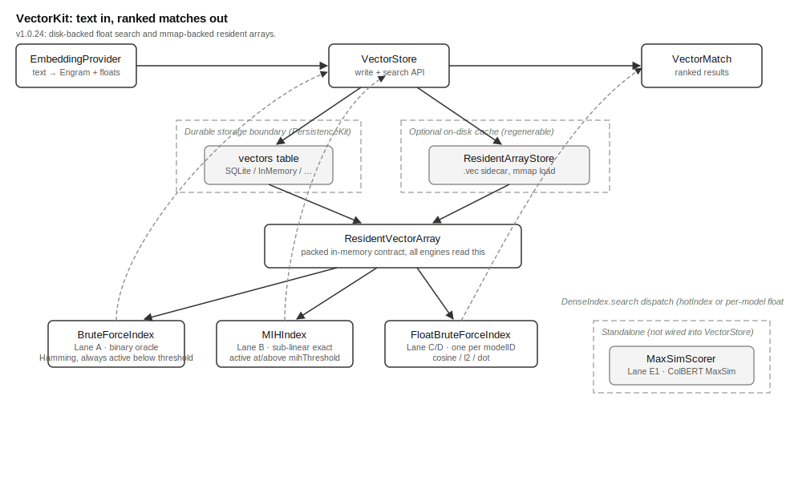

# VectorKit Overview

## Current Release Notes

VectorKit now defaults float search to the disk-backed path.
`findNearestFloat` scans the durable vector rows.
It keeps only the scored results it needs.
`.ramResident` still builds the old per-model `FloatBruteForceIndex`.

Resident sidecars now use `Data`.
That lets mmap-backed vector bytes stay outside the Swift heap.
Model strings are interned during decode.
`replaceModelVectors` now rejects int8 payloads fail-closed.

`recentItemIDs` now returns the newest distinct items first.
Its covering index avoids reading vector payloads.
Bounded sweep jobs can now reach newly captured content.
Disk-backed nearest search keeps only the requested top results.
The farthest direction now keeps the largest distance values.

## What This Library Does

VectorKit turns a piece of text into a vector. A vector is a fixed-size
code that stands in for the text's meaning. VectorKit stores that vector.
A later query can then find the most similar ones. MOOTx01 is an
on-device AI memory system. It stores what an AI observes over time. It
helps the AI recall this later. VectorKit is the part of MOOTx01 that
answers one question: which stored memories are most like this one.

VectorKit stores two kinds of vector for the same piece of text. The
first is a 256-bit binary fingerprint called an `Engram`. A sibling
library, EngramLib, defines this type. A fingerprint is a short
fixed-size code computed from a piece of content. Similar content
produces similar fingerprints. The system can then compare things
quickly without reading them in full. Two Engrams are compared by
Hamming distance. This is the count of bit positions where they differ.
A smaller count means the two are more similar. The second kind is a
dense float vector. This is a list of several hundred decimal numbers.
An embedding model, such as MiniLM, produces this list directly.
VectorKit keeps both kinds because they serve different needs. The next
section explains why.

## The Problem It Solves

An AI memory system must answer one question: find memories like this
one. It must do so without sending private text to a server. VectorKit
runs entirely on the device that captured the memory.

A 256-bit fingerprint is compact and fast to compare. Comparing two
fingerprints means counting differing bits. This is pure integer
arithmetic. The comparison never uses floating-point math. So it
produces the exact same answer on every device and every operating
system. VectorKit calls this property four-way determinism. VectorKit
never computes a fingerprint comparison itself. Every comparison is
delegated to EngramLib. EngramLib in turn delegates to a shared,
conformance-gated kernel. A conformance fixture is a recorded
input-output pair. Both an original and a ported implementation must
reproduce it exactly. EngramLib's kernel is checked this way across four
build configurations. This rule is spec I-7 in VectorKit's own design
documents. The kit performs no Hamming math of its own.

A fingerprint is compact, but this compacting has a cost. Packing
hundreds of numbers into 256 bits throws information away. Some queries
need the finer detail that the original float numbers carry. One
example is telling a passage apart from its own echoed question. The
fingerprint's collapsed form cannot always make that distinction. For
these queries, VectorKit also stores the float vector. It compares this
vector with cosine distance, a measure of the angle between two vectors.
Float math is reproducible on one platform and one build. It is not
guaranteed to produce byte-identical results on a different platform.
VectorKit documents this openly as a boundary, and not as a defect. The
binary fingerprint lane is the four-way-identical lane. The float lane
is the lane that stays reproducible within one configuration.

Every stored vector carries the model identifier and model version that
produced it. Two different embedding models turn the same word into
different numbers. These differences have nothing to do with meaning.
So comparing vectors from different models gives a meaningless answer.
VectorKit enforces this rule at multiple levels. The rule is called spec
I-4. Storage partitions vectors by model. Every search is scoped to one
model.

Finally, an on-device memory store must stay fast as it grows. Scanning
every stored vector for every query works fine at a few thousand
records. It becomes slow at a larger scale. VectorKit solves this two
ways. It keeps an in-memory copy of all fingerprints, so no per-query
database read is needed. It also switches search strategy once the
count of live fingerprints crosses a threshold. Below the threshold it
does a full scan. At or above it, VectorKit switches to a sub-linear
search structure. This structure returns the identical answer faster.

## How It Works

Writing a vector has two parts. `VectorStore.addPayload` first writes
the vector as one row to a `vectors` table. This table is the durable
source of truth. Nothing counts as stored until this write succeeds.
`addPayload` then mirrors the vector into an in-memory packed array. A
binary vector goes into one shared array. A float vector goes into a
per-model array instead. This mirroring means a later search never has
to re-read the database. The in-memory array can optionally be backed
by an on-disk cache file, called a sidecar. This lets the store reopen
without rebuilding the array from every database row.

A whole model can also be replaced in one batch. This path is
`VectorStore.replaceModelVectors`. It deletes every vector for one model
and inserts the fresh batch. It does this inside one transaction, so it
costs one disk sync for the whole batch. It then rebuilds the in-memory
array once, rather than once per vector. A model reindex changes every
vector at once. Updating the in-memory array one vector at a time would
be far slower for that case. This batch path keeps a full model
re-embed fast.

Searching has two independent paths, one per vector kind. A binary
search, `findNearest`, compares the query fingerprint against the
in-memory array using Hamming distance. Below a configurable threshold
of live fingerprints, the search does a full linear scan. The default
threshold is fifty thousand fingerprints. A full scan stays fast enough
below that scale. At or above the threshold, VectorKit switches to a
technique called Multi-Index Hashing. This technique slices each 256-bit
fingerprint into several shorter bands. It uses per-band lookup tables
to rule out most of the collection without touching it. Multi-Index
Hashing is provably exact. It returns precisely the same neighbors the
full scan would have returned, only faster. A test suite checks this by
running both searches on the same random and adversarial inputs. Both
searches must produce identical output.

A float search, `findNearestFloat`, compares the query's float vector
against a separate in-memory array. That array holds only one model's
float vectors. The comparison uses cosine, Euclidean, or dot-product
distance. Different models produce vectors of different length.
Because of this, VectorKit keeps one float array per model rather than
mixing them.

A third comparison method, `MaxSimScorer`, serves a different kind of
model. Some models produce many small vectors per item instead of one.
One example is a fingerprint per word, an approach known as ColBERT-style
late interaction. Rather than compare one vector to one vector,
`MaxSimScorer` compares every query-word fingerprint against every
document-word fingerprint. For each query word, it keeps the best match
found in the document. The document's overall score is the sum of those
best matches. This scorer is exhaustive. It never skips a candidate
document. That property makes it the correctness reference for any
faster method built later.

## How the Pieces Fit

Figure 1 shows the library's topology. It shows the major parts and how
data moves between them.

*Figure 1. Topology of VectorKit. Text enters through an
`EmbeddingProvider`. It becomes an Engram and, optionally, a float
vector. `VectorStore` writes both to the durable `vectors` table. It
also mirrors them into in-memory resident arrays. Reads dispatch through
the `DenseIndex` seam to one of three interchangeable search engines.
The dashed regions mark the durable storage boundary and the optional
on-disk cache.*

`EmbeddingProvider` is the seam a host application implements. It
supplies whatever inference technique turns text into numbers, for
example a CoreML model. VectorKit ships one concrete implementation of
its own, `FloatSimHashEmbeddingProvider`. This type takes those numbers
and projects them into an Engram fingerprint. It uses a shared substrate
primitive, `FloatSimHash`, to do this. Every provider in the MOOTx01 kit
graph then produces fingerprints the same deterministic way.

`VectorStore` is the actor every caller talks to. It owns the durable
`vectors` table, through a PersistenceKit `Storage` backend such as
SQLite. It also owns the resident in-memory arrays. Three foundation
types flow through every layer beneath it. `VectorRecordKey` names which
record this is. `VectorPayload` holds the raw typed bytes of one vector.
`DenseHit` is one scored search result. All three are shared,
additive-only types. No search engine defines its own private version of
them.

Underneath `VectorStore` sits the `DenseIndex` protocol, a pluggable
engine seam. Three concrete engines implement it. `BruteForceIndex` is
the always-correct binary linear scan and the conformance reference.
`MIHIndex` is the sub-linear binary search, gated against
`BruteForceIndex`. `FloatBruteForceIndex` is the float-lane linear scan,
built once per model. `VectorStore` decides which binary engine is
active. It compares the live fingerprint count against `mihThreshold`.
It swaps between the two engines without rebuilding either one, because
both are always kept in sync with every write.

`ResidentArrayStore` manages the optional `.vec` sidecar file. This file
is a packed, fixed-format binary cache of the in-memory array. It is a
regenerable cache, and never a second source of truth. The sidecar might
be missing, stale, or corrupted. In that case, `VectorStore` rebuilds
the array from the `vectors` table. That table is the only durable
source.

## What Ships in the Package

The package ships the Swift sources listed above. It also ships a
mirrored Rust implementation in `rust/`. It ships no bundled data
artifacts. VectorKit has no fixed reference tables of its own.
Everything it stores comes from caller-supplied text and caller-supplied
embedding models.
